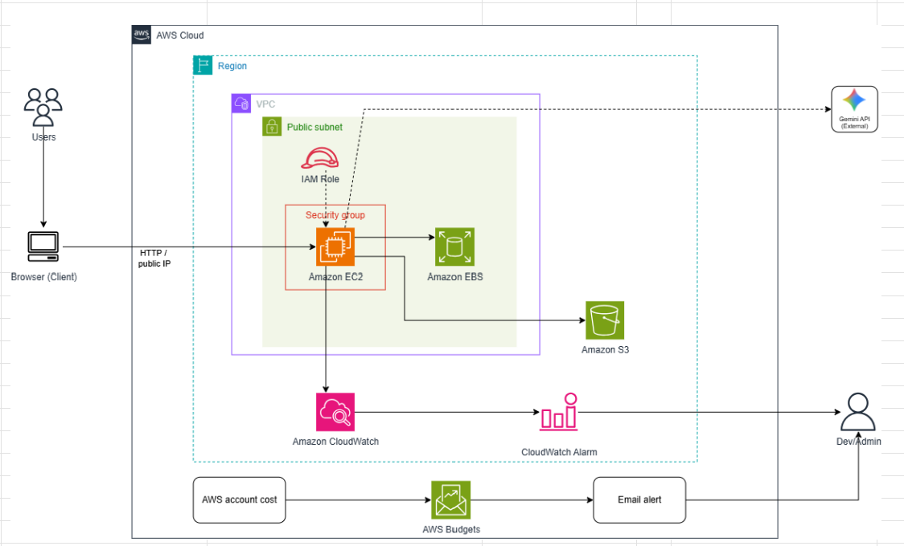
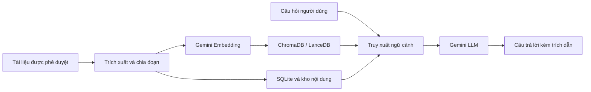

<h1 align="center">FCAJ Internship Report</h1>

<p align="center">
  <strong>FCAJ RAG Chat — Hệ thống hỏi đáp tài liệu có trích dẫn, triển khai trên AWS</strong>
</p>

<p align="center">
  Báo cáo thực tập song ngữ Việt–Anh thuộc chương trình<br>
  <strong>Workforce Bootcamp — First Cloud AI Journey (FCAJ)</strong>
</p>

<p align="center">
  
  
  
  
  
  
  
</p>

---

Repository này lưu trữ website báo cáo thực tập của sinh viên **Võ Hoàng Kim Quyên** tại **Công ty TNHH Amazon Web Services Viet Nam**. Nội dung ghi lại hành trình học tập và thực hành AWS, quá trình nghiên cứu hệ thống Retrieval-Augmented Generation (RAG), triển khai nguyên mẫu **FCAJ RAG Chat**, các bài viết kỹ thuật, sự kiện đã tham gia, workshop thực hành, tự đánh giá và phản hồi sau chương trình.

Đây là **repository tài liệu và website báo cáo**, không phải repository mã nguồn chính của ứng dụng. Mã nguồn FCAJ RAG Chat được tham chiếu tại [ngocchau04/fcaj-rag-chat](https://github.com/ngocchau04/fcaj-rag-chat).

## Mục lục

- [Giới thiệu](#giới-thiệu)
- [Xem báo cáo trực tuyến](#xem-báo-cáo-trực-tuyến)
- [Điểm nổi bật](#điểm-nổi-bật)
- [Bài toán và mục tiêu](#bài-toán-và-mục-tiêu)
- [Kiến trúc giải pháp](#kiến-trúc-giải-pháp)
- [Luồng xử lý RAG](#luồng-xử-lý-rag)
- [Công nghệ sử dụng](#công-nghệ-sử-dụng)
- [Trạng thái triển khai](#trạng-thái-triển-khai)
- [Nội dung báo cáo](#nội-dung-báo-cáo)
- [Workshop thực hành](#workshop-thực-hành)
- [Ước tính chi phí](#ước-tính-chi-phí)
- [Cấu trúc repository](#cấu-trúc-repository)
- [Chạy website cục bộ](#chạy-website-cục-bộ)
- [Triển khai GitHub Pages](#triển-khai-github-pages)
- [Tác giả và hướng dẫn](#tác-giả-và-hướng-dẫn)
- [Bản quyền và phạm vi sử dụng](#bản-quyền-và-phạm-vi-sử-dụng)

## Giới thiệu

| Thông tin | Chi tiết |
|---|---|
| Sinh viên | **Võ Hoàng Kim Quyên** |
| Trường | Trường Đại học Sài Gòn — Khoa Công nghệ Thông tin |
| Ngành / Lớp | Công nghệ Thông tin / DCT122C4 |
| Đơn vị thực tập | Công ty TNHH Amazon Web Services Viet Nam |
| Chương trình | Workforce Bootcamp — First Cloud AI Journey |
| Thời gian thực tập | 22/06/2026 – 12/08/2026 |
| Chuyên gia hướng dẫn | Nguyễn Gia Hưng |
| Giảng viên hướng dẫn | Cao Thái Phương Thanh |
| Đề tài chính | FCAJ RAG Chat — hệ thống hỏi đáp tài liệu có trích dẫn trên AWS |

Mục tiêu của kỳ thực tập là kết nối kiến thức về lập trình, dữ liệu, mạng máy tính và điện toán đám mây vào một nguyên mẫu có thể trình diễn. Dự án kế thừa năng lực RAG cốt lõi từ Kotaemon; phần đóng góp tập trung vào đọc hiểu cấu trúc hệ thống, cấu hình Gemini, chuẩn hóa Docker, thiết kế lưu trữ bền vững, triển khai AWS, sao lưu, giám sát, quản lý chi phí và tài liệu hóa quy trình.

## Xem báo cáo trực tuyến

Website báo cáo được build tự động bằng GitHub Actions và xuất bản qua GitHub Pages:

### [https://wuyen1905.github.io/fcaj-rag-chat-report/](https://wuyen1905.github.io/fcaj-rag-chat-report/)

Repository: [github.com/Wuyen1905/fcaj-rag-chat-report](https://github.com/Wuyen1905/fcaj-rag-chat-report)

## Điểm nổi bật

| Hạng mục | Quy mô |
|---|---:|
| Nhật ký thực tập | 8 tuần |
| Nội dung website | 66 tệp Markdown, gồm 33 cặp Việt–Anh |
| Bài viết kỹ thuật | 3 bài viết/bản thảo chuyên sâu |
| Sự kiện đã tham gia | 2 sự kiện |
| Workshop | 6 phần, từ chuẩn bị đến dọn dẹp tài nguyên |
| Hình ảnh minh chứng | 90 tài nguyên hình ảnh trong website |
| Báo cáo nguồn Mau9 | 35 trang, kèm bảng kiểm 24 hạng mục và ma trận 15 rủi ro |

Các nội dung chính của báo cáo:

- Phân tích nguyên lý RAG, luồng nạp tài liệu, lập chỉ mục, truy xuất và sinh câu trả lời có trích dẫn.
- Tìm hiểu Kotaemon, KTEM, Gemini, ChromaDB, LanceDB và SQLite.
- Đóng gói ứng dụng bằng Docker và triển khai nguyên mẫu trên Amazon EC2.
- Tách dữ liệu khỏi vòng đời container bằng Amazon EBS.
- Đồng bộ bản sao dữ liệu lên Amazon S3 riêng tư thông qua IAM Role.
- Theo dõi tài nguyên bằng Amazon CloudWatch và kiểm soát chi phí với AWS Budgets.
- Xây dựng worklog, proposal, workshop song ngữ, checklist kiểm thử và tài liệu bàn giao.

## Bài toán và mục tiêu

### Bài toán

Nhóm phải làm việc với nhiều báo cáo, tài liệu kỹ thuật và hướng dẫn thực hành. Tìm kiếm từ khóa truyền thống thường chỉ trả về danh sách tài liệu, trong khi mô hình ngôn ngữ dùng độc lập có thể tạo câu trả lời thiếu căn cứ hoặc không phản ánh đúng nguồn nội bộ.

FCAJ RAG Chat được xây dựng để giải quyết bốn nhu cầu:

1. Tập trung tài liệu vào một luồng nạp và lập chỉ mục thống nhất.
2. Truy xuất đúng đoạn liên quan trước khi mô hình sinh câu trả lời.
3. Hiển thị nguồn trích dẫn để người dùng có thể kiểm chứng.
4. Tạo một quy trình triển khai có thể lặp lại, giữ được dữ liệu và kiểm soát được chi phí.

### Mục tiêu của nguyên mẫu

- Tải tài liệu, tạo chỉ mục, đặt câu hỏi và nhận câu trả lời Việt/Anh có trích dẫn.
- Chạy ứng dụng nhất quán bằng Docker trên máy cá nhân và Amazon EC2.
- Duy trì dữ liệu khi container hoặc EC2 khởi động lại.
- Không đưa API key hoặc AWS credential vào Git, image Docker, log hay ảnh minh chứng.
- Sao lưu dữ liệu lên S3 riêng tư bằng quyền tạm thời từ IAM Role.
- Theo dõi trạng thái hệ thống, cảnh báo kỹ thuật cơ bản và ngân sách sử dụng.

> **Phạm vi:** đây là nguyên mẫu học thuật và bản demo nội bộ, chưa phải hệ thống production có tính sẵn sàng cao. HTTPS, xác thực người dùng, quản lý secret chuyên dụng, tự động mở rộng và khôi phục thảm họa nằm ngoài phạm vi triển khai hiện tại.

## Kiến trúc giải pháp



Kiến trúc hiện tại ưu tiên tính đơn giản, khả năng kiểm chứng và chi phí phù hợp với kỳ thực tập:

- **Amazon EC2 `t3.medium`:** chạy Ubuntu, Docker và container Kotaemon; cổng ứng dụng trong container được ánh xạ ra HTTP cổng 80 phục vụ demo.
- **Amazon EBS gp3:** lưu `ktem_app_data`, bao gồm tài liệu, chỉ mục, ChromaDB, LanceDB, SQLite và dữ liệu vận hành.
- **Amazon S3:** lưu bản sao dữ liệu và bằng chứng; bucket bật Block Public Access và được truy cập bằng IAM Role.
- **AWS IAM:** cấp quyền tạm thời cho EC2, tránh lưu access key dài hạn trên máy chủ.
- **Amazon CloudWatch:** theo dõi chỉ số EC2 và cảnh báo CPU cơ bản.
- **AWS Budgets:** cảnh báo khi chi phí tiến gần ngưỡng 15 USD của bản thử nghiệm.
- **Gemini API:** dịch vụ ngoài AWS, cung cấp mô hình hội thoại và embedding theo cấu hình dự án.

## Luồng xử lý RAG



Quy trình xử lý gồm năm bước chính:

1. Người dùng tải lên tài liệu thuộc phạm vi cho phép.
2. Kotaemon trích xuất nội dung, chia đoạn và tạo embedding.
3. Chỉ mục và siêu dữ liệu được lưu trên vùng dữ liệu bền vững gắn từ EBS.
4. Khi có câu hỏi, hệ thống truy xuất các đoạn liên quan và gửi ngữ cảnh phù hợp tới Gemini.
5. Câu trả lời được hiển thị cùng nguồn tham chiếu để người dùng kiểm tra.

## Công nghệ sử dụng

| Lĩnh vực | Công nghệ / Dịch vụ | Vai trò |
|---|---|---|
| RAG & giao diện | Kotaemon, KTEM, Gradio | Nạp tài liệu, quản lý bộ tài liệu, truy xuất và giao diện hỏi đáp |
| Mô hình AI | Gemini API, `gemini-embedding-001` | Tạo embedding và sinh câu trả lời |
| Dữ liệu | SQLite, ChromaDB, LanceDB | Lưu siêu dữ liệu, chỉ mục vector và nội dung xử lý |
| Đóng gói | Docker, Docker Compose | Chuẩn hóa môi trường và ánh xạ vùng dữ liệu |
| Compute | Amazon EC2 | Chạy ứng dụng RAG trên AWS |
| Lưu trữ | Amazon EBS, Amazon S3 | Dữ liệu hoạt động bền vững và bản sao lưu |
| Bảo mật | IAM Role, Security Group, S3 Block Public Access | Kiểm soát quyền và bề mặt truy cập |
| Quan sát & chi phí | Amazon CloudWatch, CloudWatch Alarm, AWS Budgets | Metric, cảnh báo và ngân sách |
| Website báo cáo | Hugo, `hugo-theme-learn` | Sinh website tài liệu song ngữ |
| CI/CD tài liệu | GitHub Actions, GitHub Pages | Build và xuất bản website báo cáo |

## Trạng thái triển khai

Bảng dưới đây phản ánh trạng thái có bằng chứng trong báo cáo Mau9. Các hạng mục chưa đủ bằng chứng không được mô tả như đã hoàn thành.

| Hạng mục | Trạng thái | Ghi chú |
|---|---|---|
| Cấu hình Kotaemon và Gemini | Đã cấu hình | Cần lưu nhật ký chạy mới nhất để hoàn thiện bằng chứng |
| Docker trên Amazon EC2 | Đã triển khai | Ứng dụng truy cập được qua HTTP cổng 80 trong phạm vi demo |
| Dữ liệu bền vững trên EBS | Đã triển khai | Đã tách `ktem_app_data` khỏi container; chuỗi ảnh trước/sau cần bổ sung đầy đủ |
| S3 và IAM Role | Đã triển khai; kiểm thử chưa đầy đủ | Đã đồng bộ bản sao lên S3; chưa có biên bản khôi phục hoàn chỉnh |
| CloudWatch | Một phần | Có metric EC2 và cảnh báo CPU; chưa có CloudWatch Agent, Logs tập trung và hành động thông báo hoàn chỉnh |
| AWS Budgets | Đã cấu hình | Ngân sách 15 USD; Budget chỉ cảnh báo, không tự động dừng tài nguyên |
| ECR, ECS, ALB, EFS, NAT Gateway | Chưa triển khai | Là hướng phát triển, không thuộc kiến trúc đang vận hành |

### Giới hạn bảo mật hiện tại

- Bản demo sử dụng HTTP qua public IPv4 và không được dùng cho dữ liệu nhạy cảm.
- SSH phải giới hạn theo địa chỉ quản trị; không mở `0.0.0.0/0` khi không cần thiết.
- Tệp `.env`, Gemini API key và AWS credential không được commit hoặc đưa vào image.
- Trước khi mở cho người dùng bên ngoài nhóm, cần bổ sung HTTPS, xác thực và một cơ chế quản lý secret phù hợp như AWS Systems Manager Parameter Store hoặc AWS Secrets Manager.

## Nội dung báo cáo

Website hỗ trợ đầy đủ hai ngôn ngữ. Mỗi liên kết dưới đây mở trực tiếp tệp nội dung tương ứng trên GitHub.

| STT | Danh mục | Nội dung | Tiếng Việt | English |
|---:|---|---|:---:|:---:|
| 1 | Worklog | Nhật ký mục tiêu, công việc và kết quả trong 8 tuần | [VI](content/1-Worklog/_index.vi.md) | [EN](content/1-Worklog/_index.md) |
| 2 | Proposal | Bối cảnh, mục tiêu, kiến trúc, chi phí, kiểm thử và rủi ro của FCAJ RAG Chat | [VI](content/2-Proposal/_index.vi.md) | [EN](content/2-Proposal/_index.md) |
| 3 | Blogs Posted | EC2 & chi phí, lỗi Gemini HTTP 429, bảo vệ API key bằng Parameter Store | [VI](content/3-BlogsPosted/_index.vi.md) | [EN](content/3-BlogsPosted/_index.md) |
| 4 | Events Participated | Cloud Architect và FCAJ Community Day | [VI](content/4-EventParticipated/_index.vi.md) | [EN](content/4-EventParticipated/_index.md) |
| 5 | Workshop | Hướng dẫn triển khai, lưu trữ, sao lưu, giám sát, kiểm thử và cleanup | [VI](content/5-Workshop/_index.vi.md) | [EN](content/5-Workshop/_index.md) |
| 6 | Self-evaluation | Năng lực, điểm mạnh, hạn chế và kế hoạch cải thiện | [VI](content/6-Self-evaluation/_index.vi.md) | [EN](content/6-Self-evaluation/_index.md) |
| 7 | Feedback | Trải nghiệm chương trình và đề xuất cho các khóa sau | [VI](content/7-Feedback/_index.vi.md) | [EN](content/7-Feedback/_index.md) |

Trang mở đầu: [Tiếng Việt](content/_index.vi.md) · [English](content/_index.md)

### Ba bài viết kỹ thuật

1. [EC2 tưởng đơn giản mà không đơn giản](content/3-BlogsPosted/3.1-Blog1/_index.vi.md) — Stop/Terminate, EBS, Free Tier, EventBridge–Lambda và checklist cleanup.
2. [Xử lý HTTP 429 khi gọi Gemini API trên AWS](content/3-BlogsPosted/3.2-Blog2/_index.vi.md) — retry có giới hạn, exponential backoff, jitter, concurrency và phương án fallback.
3. [Bảo vệ API key trên ECS bằng Parameter Store](content/3-BlogsPosted/3.3-Blog3/_index.vi.md) — SecureString, KMS, Task Execution Role, Task Role và least privilege.

## Workshop thực hành

Workshop hướng dẫn triển khai FCAJ RAG Chat từ đầu đến cuối trong khoảng 2–3 giờ, tùy tốc độ build image và mức độ quen thuộc với Docker/AWS.

1. [Giới thiệu và kiến trúc](content/5-Workshop/5.1-Workshop-overview/_index.vi.md)
2. [Chuẩn bị tài khoản, mã nguồn và thông số](content/5-Workshop/5.2-Prerequiste/_index.vi.md)
3. [Triển khai ứng dụng RAG trên EC2](content/5-Workshop/5.3-S3-vpc/_index.vi.md)
4. [Gắn EBS, sao lưu S3 và cấu hình giám sát](content/5-Workshop/5.4-S3-onprem/_index.vi.md)
5. [Kiểm thử chất lượng, bảo mật và chi phí](content/5-Workshop/5.5-Policy/_index.vi.md)
6. [Dọn dẹp tài nguyên](content/5-Workshop/5.6-Cleanup/_index.vi.md)

Kết quả workshop cần chứng minh được các luồng: truy cập ứng dụng, tải và hỏi đáp tài liệu có trích dẫn, dữ liệu tồn tại sau khi container khởi động lại, bản sao S3 có thể dùng để khôi phục, hệ thống có metric/cảnh báo và tài nguyên được dọn dẹp đúng cách.

## Ước tính chi phí

Bảng dưới đây là **ước tính tại thời điểm lập báo cáo tháng 8/2026**, đã gồm 15% dự phòng. Giả định gồm EBS gp3 60 GB, khoảng 2 GB S3, 1 GB CloudWatch Logs lưu 7 ngày, một alarm cơ bản và một public IPv4 trong thời gian EC2 chạy.

| Kịch bản | `t3.small` | `t3.medium` |
|---|---:|---:|
| Demo 60 giờ/tháng | 9,53 USD | **11,36 USD** |
| Demo 120 giờ/tháng | 11,71 USD | 15,35 USD |
| Chạy liên tục 24/7 | 33,73 USD | 55,89 USD |

Phương án được đề xuất là `t3.medium` chạy khoảng 60 giờ mỗi tháng, với ngân sách mục tiêu 15 USD/tháng. EC2 nên được dừng khi không sử dụng; EBS và S3 vẫn tiếp tục phát sinh phí lưu trữ. Gemini API nằm ngoài chi phí AWS trong bảng.

> Giá dịch vụ phụ thuộc Region, thời gian chạy, lưu lượng và chính sách giá. Hãy kiểm tra lại [AWS Pricing Calculator](https://aws.amazon.com/calculator/) trước khi tạo tài nguyên thực tế.

## Cấu trúc repository

```text
fcj-workshop-template/
├── .github/
│   └── workflows/
│       └── hugo.yml                 # Build và deploy website lên GitHub Pages
├── archetypes/                      # Mẫu front matter cho trang Hugo mới
├── content/                         # 33 cặp nội dung Markdown Việt–Anh
│   ├── 1-Worklog/                   # Nhật ký 8 tuần
│   ├── 2-Proposal/                  # Đề xuất FCAJ RAG Chat
│   ├── 3-BlogsPosted/               # Ba bài viết kỹ thuật
│   ├── 4-EventParticipated/         # Hai sự kiện đã tham gia
│   ├── 5-Workshop/                  # Workshop triển khai từng bước
│   ├── 6-Self-evaluation/           # Tự đánh giá
│   └── 7-Feedback/                  # Chia sẻ và góp ý
├── layouts/                         # Partial và shortcode tùy chỉnh
├── static/
│   ├── css/                         # Giao diện tùy chỉnh
│   └── images/                      # Ảnh minh chứng, sơ đồ và avatar
├── themes/
│   └── hugo-theme-learn/            # Mã nguồn Hugo theme đi kèm repository
├── config.toml                      # Cấu hình website song ngữ
└── README.md                        # Tài liệu giới thiệu repository
```

Thư mục `public/` là đầu ra sinh bởi Hugo và đã được bỏ qua qua `.gitignore`; không chỉnh sửa nội dung trong đó như mã nguồn chính.

## Chạy website cục bộ

### Yêu cầu

- [Git](https://git-scm.com/)
- [Hugo Extended](https://gohugo.io/installation/) phiên bản `0.134.3` hoặc tương thích

### Các bước thực hiện

1. Clone repository:

   ```bash
   git clone https://github.com/Wuyen1905/fcaj-rag-chat-report.git
   cd fcaj-rag-chat-report
   ```

2. Khởi chạy Hugo development server:

   ```bash
   hugo server -D
   ```

3. Mở trình duyệt tại [http://localhost:1313/](http://localhost:1313/).

4. Kiểm tra bản build production trước khi push:

   ```bash
   hugo --minify
   ```

## Triển khai GitHub Pages

Repository có workflow tại [`.github/workflows/hugo.yml`](.github/workflows/hugo.yml). Mỗi lần push lên nhánh `main`, workflow sẽ:

1. Checkout mã nguồn.
2. Cài Hugo Extended `0.134.3`.
3. Chạy `hugo --minify`.
4. Xuất bản thư mục `public/` lên nhánh `gh-pages`.

Trước lần triển khai đầu tiên, cần kiểm tra:

- Xác nhận `baseURL` trong [`config.toml`](config.toml) khớp với URL GitHub Pages hoặc tên miền thật.
- Trong **Settings → Pages**, chọn nguồn từ nhánh `gh-pages` và thư mục `/ (root)`.
- Không commit tệp `.env`, API key, credential hoặc ảnh chứa thông tin bí mật.

## Tác giả và hướng dẫn

| Vai trò | Họ tên / Thông tin |
|---|---|
| Sinh viên thực hiện | **Võ Hoàng Kim Quyên** |
| Email | [kimquyenvo04@gmail.com](mailto:kimquyenvo04@gmail.com) |
| Chuyên gia hướng dẫn | Nguyễn Gia Hưng |
| Giảng viên hướng dẫn | Cao Thái Phương Thanh |
| Đơn vị thực tập | Công ty TNHH Amazon Web Services Viet Nam |
| Chương trình | Workforce Bootcamp — First Cloud AI Journey |

### Tài liệu và dự án tham khảo

- [FCAJ RAG Chat source repository](https://github.com/ngocchau04/fcaj-rag-chat)
- [Kotaemon](https://github.com/Cinnamon/kotaemon)
- [IAM roles for applications on Amazon EC2](https://docs.aws.amazon.com/AWSEC2/latest/UserGuide/iam-roles-for-amazon-ec2.html)
- [Amazon EBS features](https://docs.aws.amazon.com/ebs/latest/userguide/EBSFeatures.html)
- [Blocking public access to Amazon S3](https://docs.aws.amazon.com/AmazonS3/latest/userguide/access-control-block-public-access.html)
- [Amazon CloudWatch alarms](https://docs.aws.amazon.com/AmazonCloudWatch/latest/monitoring/CloudWatch_Alarms.html)
- [AWS Budgets best practices](https://docs.aws.amazon.com/cost-management/latest/userguide/budgets-best-practices.html)
- [Docker bind mounts](https://docs.docker.com/engine/storage/bind-mounts/)
- [Gemini Embedding](https://ai.google.dev/gemini-api/docs/embeddings)

## Bản quyền và phạm vi sử dụng

Repository hiện không kèm tệp giấy phép mã nguồn mở. Nội dung được xây dựng phục vụ mục đích học tập, báo cáo thực tập và chia sẻ kiến thức trong chương trình FCAJ. Nếu muốn sao chép, chỉnh sửa hoặc tái xuất bản toàn bộ tài liệu, vui lòng liên hệ tác giả.

Tên dịch vụ, logo và nhãn hiệu AWS, Google, Docker, Hugo, GitHub và Kotaemon thuộc về các chủ sở hữu tương ứng. Repository này là sản phẩm học thuật, không phải sản phẩm chính thức hoặc tài liệu được Amazon Web Services bảo trợ.

---

<p align="center">
  Được thực hiện trong chương trình <strong>First Cloud AI Journey</strong><br>
  <em>Learn deeply. Document honestly. Build responsibly.</em>
</p>
